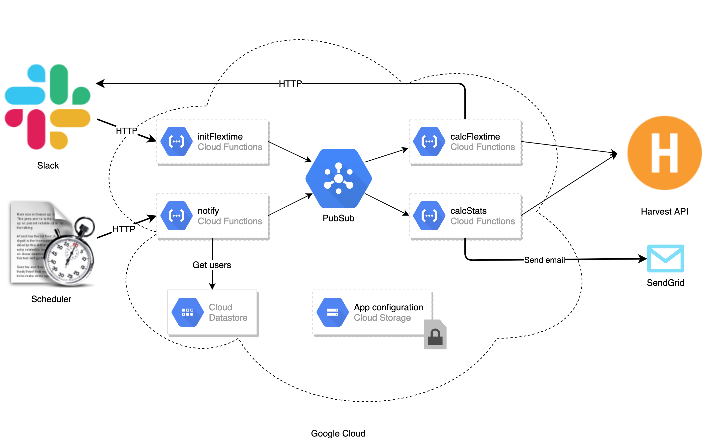
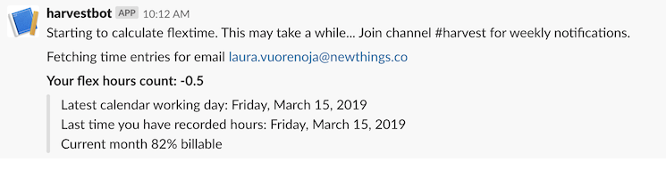
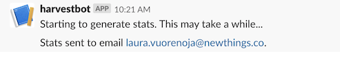

# Harvestbot

[](https://greenkeeper.io/)

Slackbot for calculating Harvest balance.

* Harvest user can query her flextime balance using the bot.
* Harvest admins can also generate excel sheets with monthly statistics of all users.
* Supports only Finnish working regulation and public holidays.

Harvestbot is deployed in Google Cloud. Functionality is implemented with Google Cloud functions that can be integrated to Slack service. Emails are sent using [SendGrid](https://sendgrid.com/)-service.



## Usage

**Show flextime balance for current Slack user**

```/flextime```




**Generate monthly statistics excel and send it via email to current Slack user**

```/flextime stats 2019 3```



Statistics sheet displays work time statistics for each company employee. The second tab gives detailed information for billable hours that can be used as the basis for billing.

## Development

Harvestbot functionality can be triggered from local machine using CLI-interface. Install relevant tools and setup environment variables first.

### Environment setup

* [nvm](https://github.com/creationix/nvm) (or install and activate Node version required in file ./nvmrc)
* [direnv](https://github.com/direnv/direnv) (or manage environment variables as you prefer)
* You need an existing [Google Cloud](https://console.cloud.google.com/) project to run the code.
* [Download key](https://cloud.google.com/docs/authentication/getting-started) in JSON format from cloud console to be able to acccess your project.
* Export relevant Google Cloud configuration variables:

```
# .envrc

# Google cloud project ID
export GCLOUD_PROJECT=XXX

# Google cloud region for cloud functions
export GCLOUD_FUNCTION_REGION=XXX

# Path to JSON file you created in Google Cloud console
export GOOGLE_APPLICATION_CREDENTIALS=/path/to/file.json

...
```

* If you already have an existing (and deployed) Google Cloud project, you can print out the app current configuration with the decrypt command. 
* For new projects you need to define the configuration data from scratch:
  * Create API token for your Harvest account in [Harvest developer view](https://id.getharvest.com/developers). Your Harvest user needs to have admin-level rights to be able to access all features.
  * Create API key for [SendGrid](https://sendgrid.com/)-service.
  * Fetch company task information with [API request](https://help.getharvest.com/api-v2/tasks-api/tasks/tasks/). You need the task ids for configuring flextime calculation correctly.
* Define following environment variables:

```
# .envrc

...

# Access token you fetched from Harvest developer UI
export HARVEST_ACCESS_TOKEN=XXX

# Harvest account ID you fetched from Harvest developer UI
export HARVEST_ACCOUNT_ID=XXX

# Key you fetched from SendGrid
export SENDGRID_API_KEY=XXX

# Allowed email domains for users
export ALLOWED_EMAIL_DOMAINS=newthings.co,newthin.gs

# Harvest company account specific configurations
# Task id for public holidays
export TASK_ID_PUBLIC_HOLIDAY=123
# Task id for vacation time
export TASK_ID_VACATION=124
# Task id for unpaid leave
export TASK_ID_UNPAID_LEAVE=125
# Task id for sick leave
export TASK_ID_SICK_LEAVE=126
# Task id for flex leave
export TASK_ID_FLEX_LEAVE=321

```

### Running locally

```
> nvm use 
> npm install
> npm run build
> node ./build/local.js --help
Usage: local [options] [command]

Options:
  -v, --version                 output the version number
  -h, --help                    output usage information

Commands:
  stats <email> <year> <month>  Send monthly statistics to given email address.
  flextime <email>              Calculate flex saldo for given user.
  encrypt                       Encrypt and store app configuration.
  decrypt                       Decrypt and show app configuration.
```


## Deployment

### Storing encrypted app configuration

App configuration should be stored to Google Storage using CLI-feature encrypt before deploying the cloud functions.

### Cloud functions deployment

This project CI configuration gives an example how Harvestbot cloud functions can be deployed to Google Cloud.

### Integrate bot to Slack

[Configuring Slash commands](https://api.slack.com/slash-commands).

### Trigger notfications

Weekly flextime notifications are triggered using CircleCI cron jobs.
